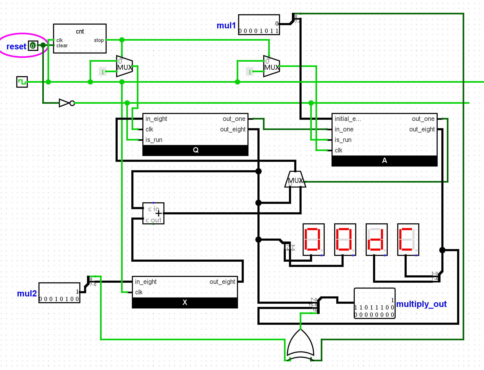
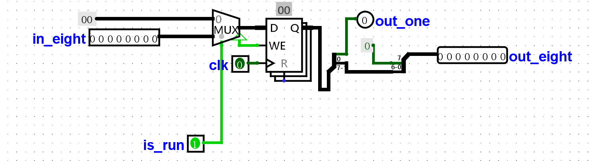
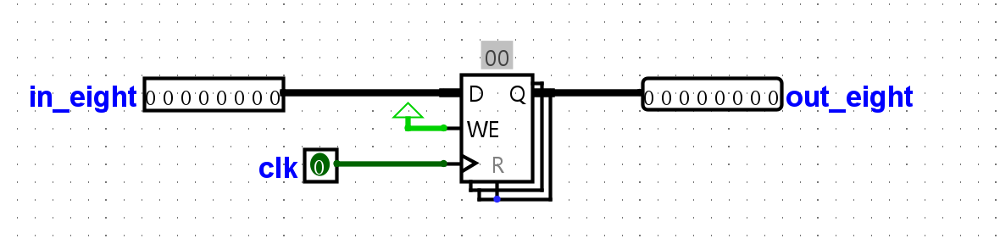
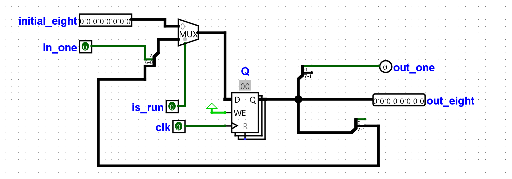
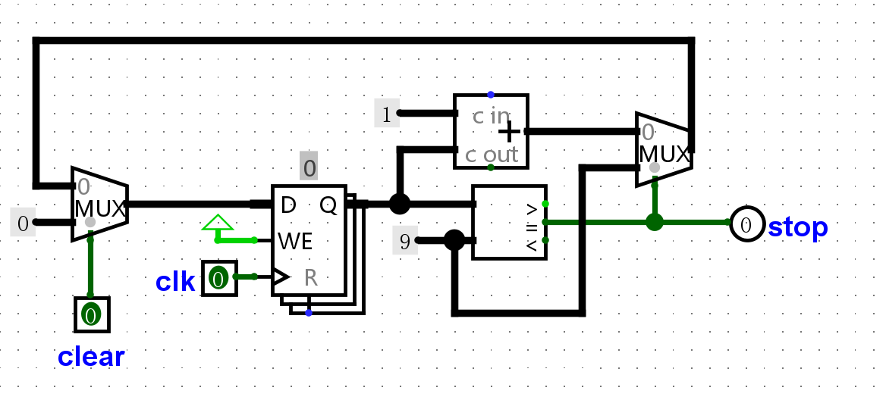

# 一位符号位，八位数据位乘法器

严格按照唐朔飞书中乘法器的结构思想组织
## 设计图

## 总图：

## Q：

### 输入：

当is_run为0时，寄存器进行初始化为0

in_eight:加法器计算结果

### 输出：

out_one:移位产生的末位

out_eight:用于数码管显示

## X:

## A:

### 输入：

当is_run为0时，寄存器进行初始化，读取in_eight输入的mul1数据位部分

in_one:Q的末位

### 输出：

out_one:移位产生的末位，用于后续控制

out_eight:用于数码管显示

## cnt:

### 输入：

clear:与is_run共用同一信号,用于初始化计数器清零

###     输出：

stop:控制多路复用器，切换时钟信号为常量

带有锁功能，即到达计数预定值则切断时钟信号

# 演示视频：

[点击下载视频](./src/video.mp4)

> 注意：由于Markdown文件的安全限制，视频无法直接在本地播放。请点击上方链接下载后观看。

